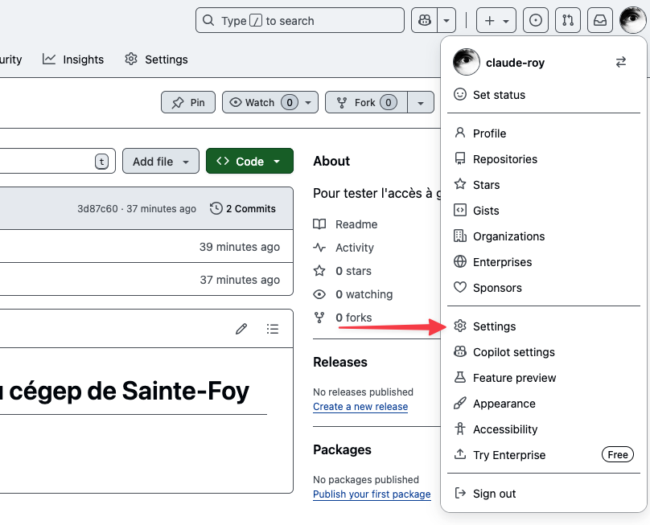
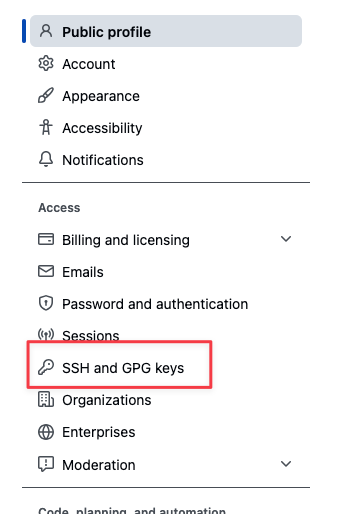
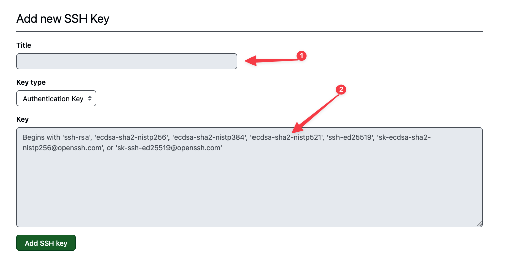
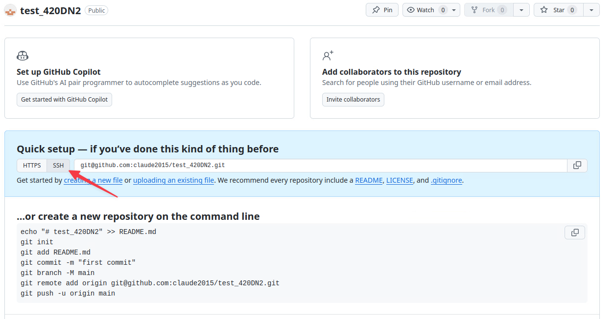

# Exercice 22 - Utilisation de Git

- Type de travail : individuel
- Durée estimée : 2 heures
- Système d'exploitation : Linux XUbuntu
- Environnement : virtuel, vSphere.

### Objectifs

Cet exercice a pour objectifs:

- Ajouter votre clé ssh à un votre compte Github
- Créer un dépôt Github
- Récupérer et modifier un dépôt Github

## Section 1 Ajouter votre clé ssh à un votre compte Github  

- Connectez-vous à votre machine XUbuntu.  
- Ouvrir Firefox et aller sur le site de Github : [https://github.com](https://github.com)
- Si ce n'est pas encore fait, créer un compte.  
- Cliquer sur votre avatar à droite et choisir *Settings*.  

  
**Image 1 : Github settings**

- Dans le menu de gauche, cliquer sur *SSH and GPG keys*.  

  
**Image 2 : Github ssh keys**

- Cliquez sur *New SSH key*.  

- Donnez un nom significatif à votre clé et prenez la clé publique de votre XUbuntu et la copiez dans la zone key. Cliquez sur *Add SSH key* pour terminer.    

  
**Image 3 : Github nouvelle clé ssh**

## Section 2 Créer un dépôt Github  

- Cliquez sur votre avatar à droite et choisir *Repositories*.  
- Cliquez sur new à droite :   
- Donnez le nom **test_420DN2** à votre dépôt et cliquer *Create repositery*.  
- Dans la page de votre nouveau dépôt, choisir SSH comme méthode de transfert.  

  
**Image 4 : Github transfert ssh**  

- Dans une invite de commande de votre XUbuntu, créer le répertoire suivant :  

```bash
mkdir -p ~/Documents/test_420DN2
```  

-  Déplacez-vous dans le nouveau répertoire et faire les commandes git pour vous connectez à votre compte Github.  

```bash
git config --global user.email "vous@exemple.com"
git config --global user.name "Votre nom d'usager Github"
```  
-  Faire les commandes affichées dans la page Web de votre nouveau Dépôt.  

```bash
echo "# test_420DN2" >> README.md
git init
git add README.md
git commit -m "first commit"
git branch -M main
git remote add origin git@github:-votre_usager-/test_420DN2.git
git push -u origin main
```  
- Rafraichir la page Web de votre dépôt pour voir votre page README.md.  

## Section 3 Récupérer et modifier un dépôt Github  

- Rendez-vous sur mon dépôt à l'adresse [https://github.com/claude-roy/test_ste-foy](https://github.com/claude-roy/test_ste-foy)
- Faite un Fork de mon dépôt. Voir dans le coin droit cet outil :   

**Question**: Qu'est-ce qu'un "fork" en Git?
<details>
	<summary markdown="span">Réponse :</summary>

> Les utilisateurs qui n’ont pas la permission de pousser sur un dépôt peuvent en faire un fork (créer leur propre copie), pousser des commits sur cette copie et ouvrir une requête de tirage (Pull Request) depuis leur fork vers le projet principal. Ce modèle permet au propriétaire de garder le contrôle total sur ce qui entre dans le dépôt et quand, tout en autorisant les contributions des utilisateurs non fiables.
Source : Pro Git

</details>

--

- Récupérer votre fork de mon dépôt par la commande ```git clone nom_de_votre_copie``` sur votre poste de travail.
- Modifier le fichier README.md en y ajoutant votre nom dans la liste des contributeurs.
- Pousser votre modification sur votre dépôt sur Git Hub avec la commande <code>git push</code>. Si vous avez bien inséré votre clé SSH sur GitHub, vous ne devriez pas avoir besoin de vous authentifier.
- Sur votre page de GitHub, faites une demande de Pull Request pour que j'accepte de modifier le dépôt principal de votre contribution. Soyez gentil, écrivez un message avec votre demande.  Sinon, peut-être que je n’accepterais pas votre demande.;-)

Pour vous aider : [https://git-scm.com/book/fr/v2/GitHub-Contribution-%C3%A0-un-projet](https://git-scm.com/book/fr/v2/GitHub-Contribution-%C3%A0-un-projet)  

